# UI11116: Web Applications Development 2021/22

## Student ID: 19000170

## Contents

  - [Contents](#contents)
  - [Introduction](#introduction)
    - [Repository](#repository)
    - [Deployed Application](#deployed-application)
    - [Methodology](#methodology)
  - [Structure](#structure)
      - [Non "src" changes](#non-src-changes)
      - ["src" changes](#src-changes)
        - [Pages](#pages)
          - [Login Page](#login-page)
        - [Problem Index](#problem-index)
        - [Question Page](#question-page)
      - [Additional Technology](#additional-technology)
        - [Firebase](#firebase)
        - [Bootstrap](#bootstrap)
        - [run-script](#run-script)
        - [VS Code addins](#vs-code-addins)
  - [Task Breakdown](#task-breakdown)
    - [Task 1: Live Chat Support](#task-1-live-chat-support)
    - [Task 2: FAQ](#task-2-faq)
    - [Task 3: Percentage for Responses.](#task-3-percentage-for-responses)
  - [Evaluation and final thoughts](#evaluation-and-final-thoughts)


***

## Introduction

This assignment was to take a pre-existing web page (which was part of a larger whole) and recreate using React.  Data for the page was provided in JSON format.  In addition to creating the page, three new features had to be added.  In completing this work, React had to be learned (to at least a moderate level) as well as several features of the Google Firestore suite (specifically Firebase.)

The assignment was liked to a "Spike" in Agile.  A spike can be defined as _"A task aimed at answering a question or gathering information, rather than at producing shippable product."_  So, the idea is not to produce "production-ready" code.  For this assignment, only a single page has been created, however, to add to the visual experience, some extra elements have been added.

### Repository

All code (including this README file) can be found at [https://github.com/adamsjoe/assignment219000170](https://github.com/adamsjoe/assignment219000170) which is a public GitHub repository.

### Deployed Application

The application has been deployed at [https://assignment219000170.web.app](https://assignment219000170.web.app)

### Methodology

To track work on this assignment, a Kanban board was created.  Initially, this was created with Github but later moved to use the Miro platform.  The miro platform allowed for slightly better organisation (for me) as I could tag tickets and implement a basic priority system.

The read-only Miro board can be found at: [https://miro.com/app/board/uXjVODxHWbc=/?share_link_id=950433864690](https://miro.com/app/board/uXjVODxHWbc=/?share_link_id=950433864690)

A simple tagging system was also implemented.  The tags, and their meanings, are in the table below:

| Tag                      | Description |
| ------------------------ | ----------- |
| **New Feature**          | These tickets relate to the new features requested on the assignment. |
| **Helper**               | These tickets relate to any task which will aid the progress of the work. |
| **Support Task**         | These tickets relate to any task which is needed to complete the main work. |
| **Bug Bash**             | These tickets relate to fixing any minor issues which could be classed as bugs.|
| **Stretch Goal**         | These tickets are "nice to haves" and not required to complete the assignment. |
| **Investigation Needed** | These tickets require some form of reading up, studying, or off-project proof of concept work. |
| **Bug**                  | These tickets are bugs within the application. |
| **Refactor**             | These tickets relate to features that are complete but could be tidied up. |
| **Unplanned Work**       | During the assignment, a hardware failure prompted the setting up of a new computer.  This meant redoing some tasks from before.  Recorded with this tag. |

## Structure

The starting point for this assignment was the 'create-react-app' package.  This script created a basic project which was then customised.  Many of these changes were created within the "src" folder, but a few were outwith this folder.

#### Non "src" changes

* Added a 404.html file.  It was discovered that firebase will automatically serve any file called 404.html if the user attempts to navigate to a page that does not exist.  This file must be present in the "public" directory.  This was, essentially, "free" functionality requiring nothing more than creating a file.  No routes had to be added, just the 404.html file.  It was not asked for in the assignment, but it was felt that as this was a spike, the chances of users thinking the application was ready was high, so the 404 was a "safety net" to avoid any embarrassing blank screens.  An image of the 404 page is shown below (however the 404 is animated.)
  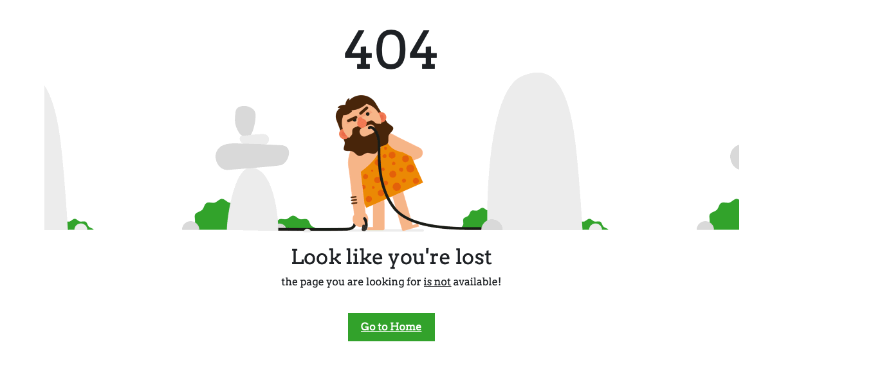
* The favicon was changed from the default react image to the university logo.  This was again not requested, but it was felt that making this small change made the application look a little more polished and less like a hacked-together spike.
* The index.html had the title changed as well as included the font-awesome library - the font-awesome library was used for the chat icon as well as the file upload button (more on that later.)

#### "src" changes

There were many changes from the create-react-app within the "src" directory. 

Several new directories were created.  These are outlined below:

| Directory Name | Function |
| -------------- | -------- |
| components     | To aid project organisation, certain features were split off to be used as components.  |
| icons          | This is only used to store the SVG for the site logo. |
| pages          | Three main pages were identified for this project.  These are outlined later, but the files are here. |
| styles         | All CSS files for the application are kept here. |

##### Pages

As indicated above, 3 pages were identified.  These are the main touchpoints that the user will navigate when using the site.  The three pages are:
* LoginPage
* ProblemIndex
* QuestionPage

When the application first loads, assuming that no user has previously been left "logged in" then the user will see the following:
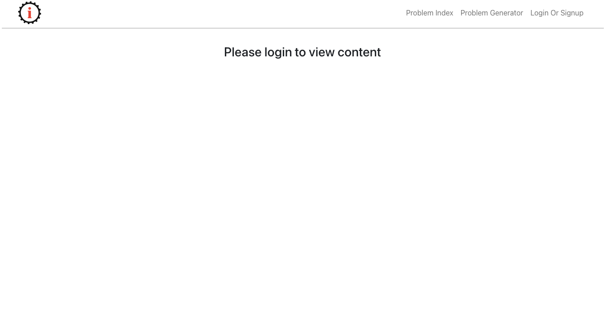
This image shows the NavBar, which in breaking with the "component" methodology, has been created as part of the App.js file.  This means the NavBar (and all associated functions) will be available throughout the application.  On the NavBar there are 3 links
* Problem Index - this link redirects the user back to the root of the project.  The root of the project will vary depending on whether the user has logged in or not.  By default, it shows the same "please login to view content" page.
* Problem Generator - this was on the i-want-to-study-engineering site.  The assignment had no information for this, so this link is disabled.  This was added purely as a visual element.
* Login or Signup - will navigate to the login page.  The sign-up function was not part of the assignment and has been left out.  If the user has logged in, then this link will allow them to log out.

###### Login Page
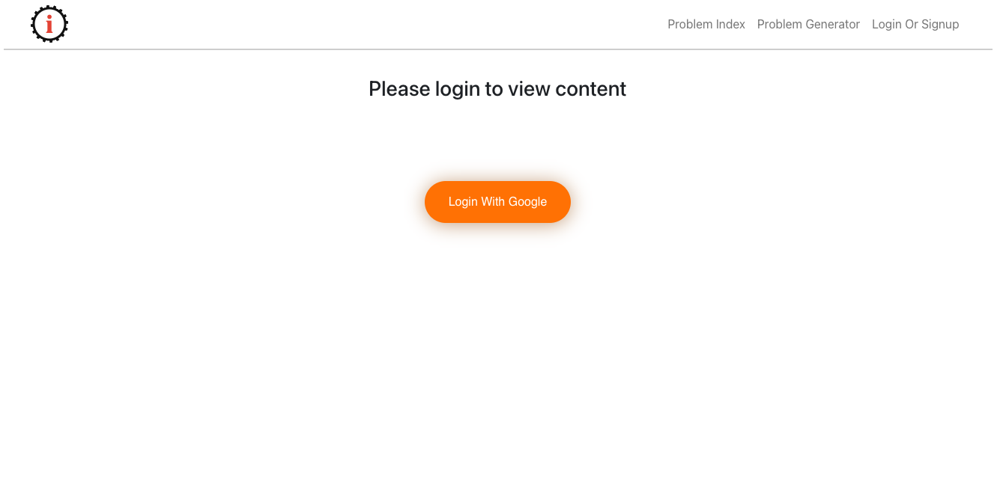

The loginPage contains a single button.  This button will launch a Google popup.  If the user has previously used a google account, this popup will briefly appear and used the stored credentials.

##### Problem Index

If the user __has not__ logged in, then the ProblemIndex will show the "Please login to view content."  The assignment asked that a user needed to login before they could view anything.  Once the user has logged in, the ProblemIndex page shows the following:
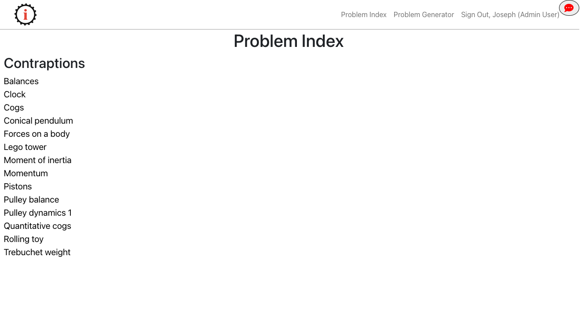
Note: for this assignment, data was available for the "Balances" problem only.  So all links _except_ balances have been disabled.  The CSS for the active link (only "balanaces" has been created to look the same as the i-want-to-study-engineering site.

##### Question Page

Clicking on the "balances" link (or if this was a fully developed site, any link) will load the Problem Page with the appropriate questions:
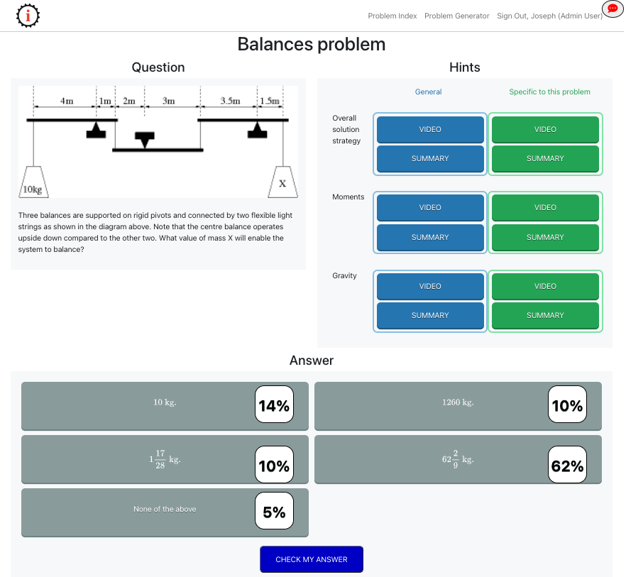  In the full site, the URL would be used to load the appropriate question and answer data.  For this spike, this has been hard-coded (as only the balanaces data was avaiable.)

This page has been made up of several components:
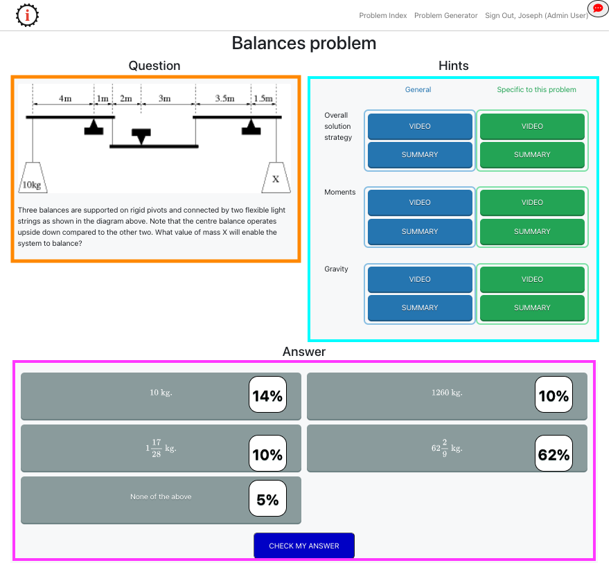

* The orange box shows the "QuestionComponent"
* The blue box shows the "HintComponent"
* The purple box shows the "AnswerComponent"

Each of these components is stored in the ```src/components``` directory - other components are also present here.

| Component Name     | Function |
| ------------------ |
| AnswerComponent    | As above - this shows the answers to the question which has been asked. |
| ChatModal          | Used in the chat feature.  Will be covered in that section. |
| CheckAnswerModal   | When the user clicks on an answer and then "check my answer" this modal appears to inform them of either a correct or incorrect answer. |
| HintComponent      | As above - this shows the videos and images to help the user answer the question. |
| ImageModal         | When the user clicks on an image, this is displayed in a modal |
| QuestionComponent  | As above - this shows the image and question text the user needs to answer. |
| VideoModal         | When the user clicks on a video link, this is shown in a specific modal. |

It should be noted that the images and videos all work.  This was not a requirement for the assignment, however, images are easy to display with HTML, and with HTML 5 has the ```<video>``` tag, not adding these did not make any sense.  Adding them adds to the overall presentation of the spike.

#### Additional Technology

##### Firebase
To make this application work, Google's Firebase was used as a backend data source.  The data needed was originally supplied in JSON format (and this can be found in the "data" folder within the repo.  This data is as was given, with one minor exception of removing a split line to aid readability.)  This data was transferred to a firestore document (in this case called "balances")

A snapshot of this can be seen below: 

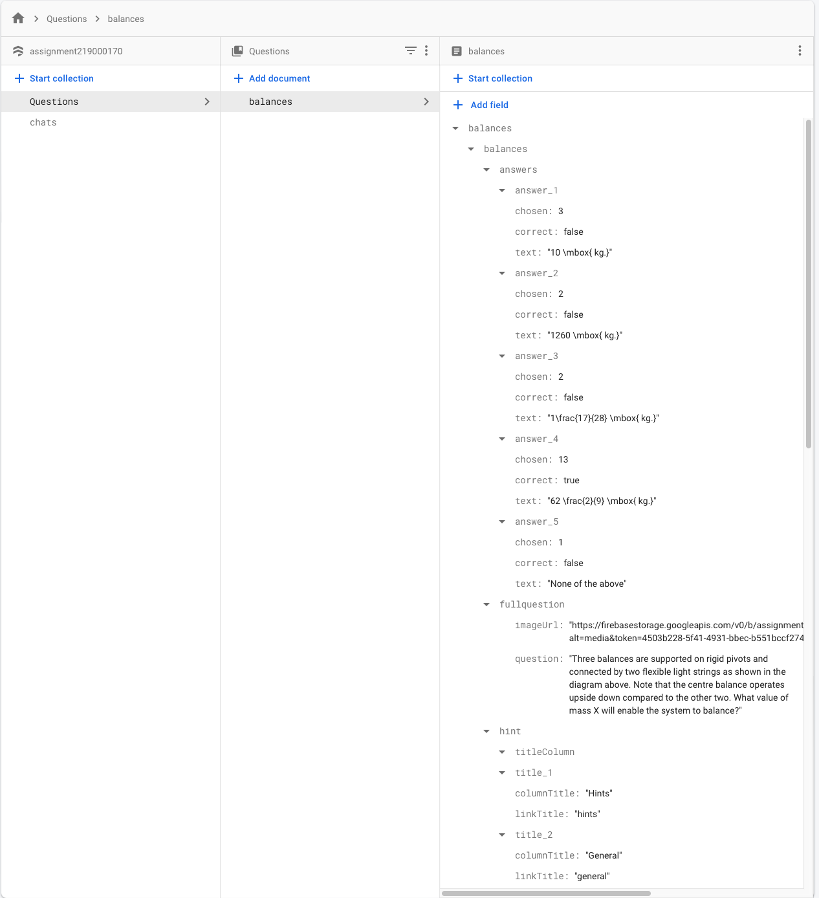

Note: this is a snapshot - it does not show **all** the data.

##### Bootstrap

To make the layout of the page, bootstrap was used.  However, rather than load bootstrap using the index and a CDN, the react-bootstrap package was chosen as it allowed for slightly easier to read code and is a more "react" way of doing this.

##### run-script

Looking at the package.json file, a new entry can be seen in the "scripts" section.  This entry is ```"fullDeploy": "react-scripts build && ./node_modules/.bin/firebase deploy"``` - this was added to aid in deployment, running this command with ```npm run-script fullDeploy``` will automatically build the application and deploy this to the firebase servers.  As part of this deployment, 2 additional files exist in the repo.  These are "firestore.rules" and "storage.rules" - these files are what the developer would set up on the firebase console.  With these kept in source control, we have better control over any changes to our infrastructure, while Google does provide a history for changes to firestore rules, with these files in source control, we have much better control over the changes and, more importantly, the ability to revert anything which is found to be wrong.

##### VS Code addins

Several addins have been configured in VSCode.  

First among these was installing the fira code font.  This does nothing to the code on the server, it merely aids readability for the developer locally.  Firacode is a monospaced font with ligatures.  It can be found: https://github.com/tonsky/FiraCode

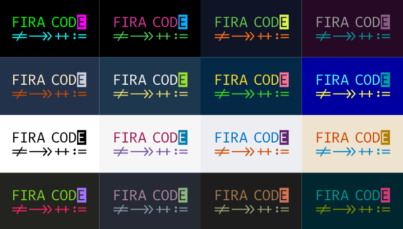

The main benefit of fira code is the use of ligatures.  The image above shows the equals with a strike-through which is used in place if ```!=```

Also installed was CSpell - which is a spell checker for VS Code.  Any unknown words will be flagged up in the problems tab of VS Code.  Words can be added to the dictionary by adding them to the cspell.json file in the project root.

## Task Breakdown

### Task 1: Live Chat Support

Live chat support was challenging as it was felt this feature was not well specified.  There were some questions which needed to be asked and a "best approach" was taken.  
In the end, some liberty has been taken with this feature.  Specifically:
* Each video can have a chat.
* Each of those chats can be locked (the specification calls for a thread to be locked for 3 days, or until an admin has answered.)
* Only videos can start a chat - images do not start any chat functionality.  This was decided based on the screenshot in the assignment documentation
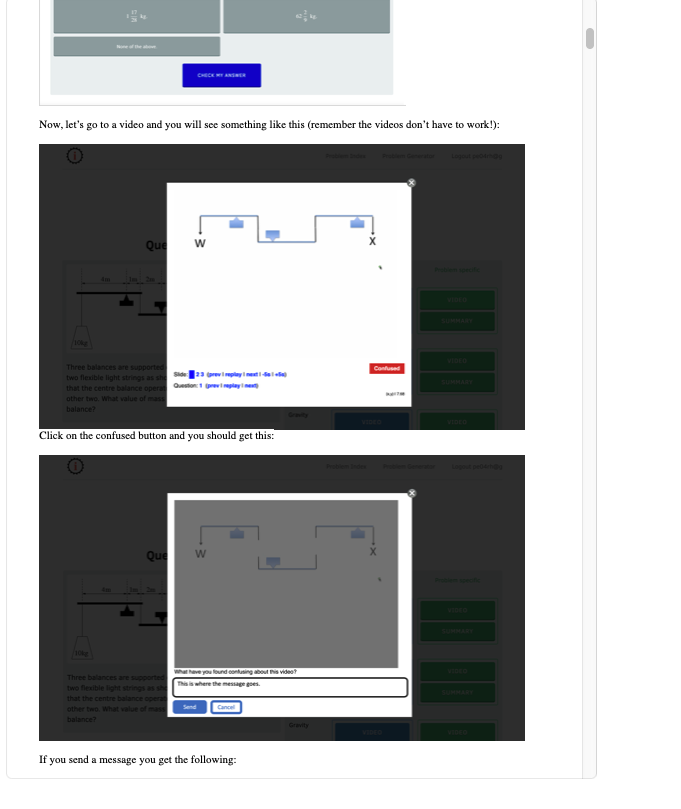
* Only videos can show the FAQs - this was decided as a follow-on to the point above.  It also made sense that the FAQs would be specific to the video.
* It made sense to have a separate chat component - and once it was decided that each video could have its' chat, it made sense to tab this window.

To accomplish this task, firstly, the videos were uploaded to firestore.  The URLs were then added to the document The UI was then constructed, firstly with a video to merely display the video.  As the i-want-to-study-engineering site had both videos and images shown in modals.  Initially, a pure CSS approach was looked at, but some research found that bootstrap had a modal componenFortunately, react-bootstrap (like its CDN counterpart) has a modal component, so this is what would be used.   Next was to determine how this modal would be used.  It was considered having a single modal component and then having this displayed differently depending on if an image or a video was selected.  However, this was rejected.  Splitting into a modal for images and a modal for videos allowed a better separation of concerns as images wouldn't have the chat (or the FAQ.)  Then the logic for the confused button was added.  Finally, the thread "locking" mechanism was added.  This took care of how a user would initiate a chat, but it was not the chat feature.

To add the final chat feature, a method was needed to call the chat.  It was decided to have an option on the NavBar.  This would allow the chat to be called from anywhere in the application.  Initially, it was envisioned to have a "count" of unread messages, but it was then determined that this would be complex and needless over-complicate the assignment.  In keeping with the "spike" methodology, the count was removed and a much simpler action would be added.  A simple button that would call a chat modal. This did go against the specification (which called for an element with the user's initial) but it was felt that this approach was cleaner, gave purpose to the navbar and was much simpler for a user to understand.

The button was styled with a font awesome icon.   In keeping with the requirement that nothing is accessible unless logged in, the chat icon will only appear if a user has logged in.

Clicking on the button will open the chat feature.
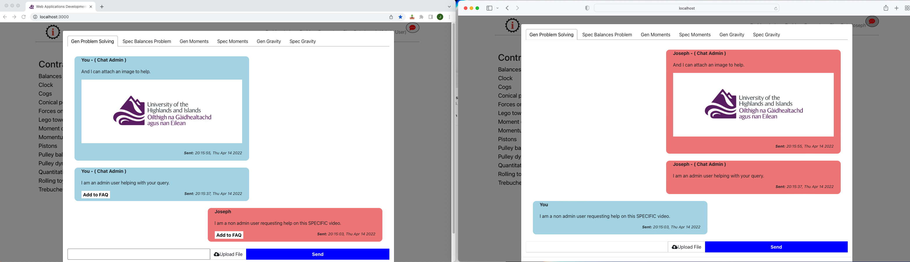

As noted at the beginning of this section, the requirements were unclear about the chat feature, so some liberty was taken with the UI.  As can be seen, there are 6 tabs (one for each video - the name has been derived from the JSON for the video) and each of these tabs is separate, what is entered into one tab is not shown in the others.  As can also be seen from the screenshot, the Admin user (on the left) has an "Add to FAQ" button, while the non-admin has none (but this is the second feature and will be spoken about there.)

The work for the live chat feature was contained within tickets:

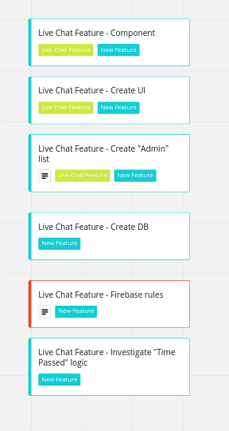

To support the chat feature, a new firebase collection was created.  This collection was named "chats."

The **chats** document was constructed with the following fields:
```
{
  addedToFAQ: (boolean)
  content: (string)
  image: (string)
  isAdmin: (boolean)
  timestamp: (number)
  type: (StudentQuery)
  userName: (array)
    0: (string)
    1: (string)
  uuid: (string)
  video: (string)
}
```

When a chat is initiated (via the video) then a new document is created which will populate the fields in the document.  When the user moves to the chat portion, depending on which tab is clicked, a query will run to pull back, in descending time order, the chats for that specific video.  This is done using the following query:
```javascript
const query = firestore.collection('chats').where('video', '==', activeTab).orderBy('timestamp', 'desc');
```
The "activeTab" variable comes from the user clicking on the tab.  The react-tab package will return an index of the tab which has been clicked:
```javascript
<Tabs defaultIndex={0} onSelect={(index) => setActiveTab(chatNames[index])}>
```
To match this up, a simple array was declared:
```javascript
  const chatNames = [
    'problem_s',
    'spec_strat_balan_s',
    'mom_s',
    'spec_mom_s',
    'gravity_s',
    'spec_gravity_s',
    'info',
  ];
```

The Tabs are created in by use of the react-tabs package and are defined with the following code:

```jsx
 <Tabs defaultIndex={6} onSelect={(index) => setActiveTab(chatNames[index])}>
  <TabList>
    <Tab>Gen Problem Solving</Tab> {/* (problem_s) */}
    <Tab>Spec Balances Problem</Tab> {/* (spec_strat_balan_s) */}
    <Tab>Gen Moments</Tab> {/* (mom_s) */}
    <Tab>Spec Moments</Tab> {/* (spec_mom_s) */}
    <Tab>Gen Gravity</Tab> {/* (gravity_s) */}
    <Tab>Spec Gravity</Tab> {/* (spec_gravity_s) */}
    <Tab>Info</Tab>
  </TabList>

  <TabPanel>
    {showChat()}
  </TabPanel>

  <TabPanel>
    {showChat()}
  </TabPanel>

  <TabPanel>
    {showChat()}
  </TabPanel>

  <TabPanel>
    {showChat()}
  </TabPanel>

  <TabPanel>
    {showChat()}
  </TabPanel>

  <TabPanel>
    {showChat()}
  </TabPanel>

  <TabPanel>
    Please select the tab of the video you are interested in.
  </TabPanel>
</Tabs>
```

First the ```<TabList>``` defines all the tabs in the system - and thir names.  In the opening tab, it can be seen the default tab is set to 6 - which is "Info" here.  There is also an onSelect handler which will set a state variable, explained above.  It should be noted there is an extra element with helper text.  It was found during testing that the chat messages were not displaying with the correct classes until a tab had been picked.  The info tab was a late minute change to force the user to click on the tab and is a workaround to stop the user seeing the bug.
This results in the query being updated with the appropriate video when the user clicks on a tab.

In terms of the chat, this is all dealt with with the following code:
```javascript
        <div className=''>
          <div className='userLayout'>
            {localMessages.map((localMessage) => (              
              <div className={`${userId}` === `${localMessage.uuid}` ? 'fromUserLayout userCurrentLayout' : 'fromUserLayout userOtherLayout'} >
                {console.log("")}
                <div className={`${userId}` === `${localMessage.uuid}` ? 'user userCurrent' : 'user userOther'}>
                  <p className='chatUser'>{`${userId}` === `${localMessage.uuid}` ? 'You' : localMessage.userName[0] } {localMessage.isAdmin === true ? '- ( Chat Admin )': ''}</p>
                  <p>{localMessage.content}</p>
                  { localMessage?.image && localMessage.image.length > 0 &&  }
                  <p className='chatTimestamp'><b>Sent:</b> {new Date(localMessage.timestamp).toLocaleTimeString()}, {new Date(localMessage.timestamp).toDateString() }</p>
                  {(admin === true && localMessage.addedToFAQ === false) ? <button className='addFAQButton' onClick={async () => {
                    await firestore.collection('chats').doc(localMessage.mid).update({
                      addedToFAQ: true,
                    });
                  }}>Add to FAQ</button> : ''}
                </div>
              </div>),
            )}
          </div>
```

This code will take the output of the query run when a tab is clicked, and then will determine if the message belongs to the user, or if it belongs to another user.  This will determine which CSS class is used.  This same mechanism will also be used to show the name of the user who sent the message.  If it was the logged-in user, the name is replaced with "You" - otherwise their first name is shown.  And if the user is admin then "(admin)" is appended.

Admittedly, these tickets could have been broken down to a much lower level.  Indeed, if this was a multiple-person project it would have been essential to break these down into lower-level tasks.  However, as this was a single-person project - these 6 tickets were enough to track the progress.

### Task 2: FAQ

Following on from the Live Chat feature is the Add to FAQ section. This is made up of 2 parts.  The first part is a mechanism to add entries to the FAQ and the second part is to view these messages.  The adding part was fairly easy to implement.  When a chat message has been created, it has a field for "addedToFAQ" and this is set to false.  

The tickets for this feature are:

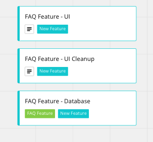

The code for this was already shown above in Live Chat feature.  Specifically, the code for adding to the FAQ is the following:
```javascript
{(admin === true && localMessage.addedToFAQ === false) ? <button className='addFAQButton' onClick={async () => {
  await firestore.collection('chats').doc(localMessage.mid).update({
    addedToFAQ: true,
  });
```

Here, two things are happening.  Firstly, if the user is an admin, and the message hasn't been added to the FAQ already, then an "Add to FAQ" button is added to the post, otherwise, no button is added.  The button has an onClick handler, which will update the addedToFAQ field in the current message.

For a user to view the FAQs, they need to go to the video and open one of the videos:

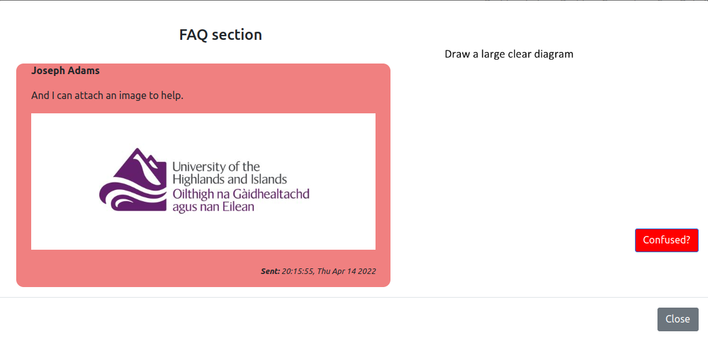

Here, the FAQ entry can be seen.  Note that each video has its' own unique FAQ section - from this example, clicking on a different video shows an empty FAQ (below)

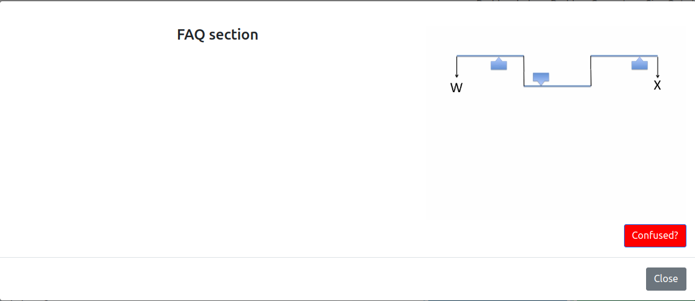

This completes the work for the FAQ feature.

### Task 3: Percentage for Responses.

The final feature was to present a percentage of how many times an input had been clicked.  Again there was some confusion on if this would be shown at all times, or should the user need to ask for a hint (this was a personal opinion) - however taking the screenshots as the requirements, this was interpreted to mean that the percentages would appear at all times.

The tickets for this feature are displayed below:

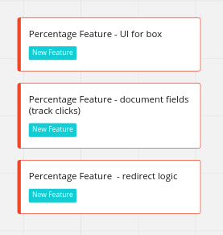

This was also a very simple feature to implement.  To accomplish this, the document which held the question, the question image, the answers, the video URL, and the images had an extra field added (specifically to the answers section).  So each "answer" had the following:

```
{
  chosen: (number)
  correct: (false)
  text: (string)
}
```

Now - this structure is used to populate the answer buttons at the bottom of the page.  If the user selects an answer and then clicks "check my answer" the ```correct``` field is used to determine if the "correct answer" video should be shown, or if the "wrong answer" modal is shown.

Back to the percentages.  The way this is coded, when the AnswerComponent is loading, the following will run
```javascript

  const collectionId = 'Questions';
  const documentId = 'balances';
  const [answers, setAnswers] = useState([]);

  useEffect(() => {
    const getFirebase = async () => {
      const snapshot = await firestore.collection(collectionId).doc(documentId).get();
      const questionData = snapshot.data();

      // now we add the answers and correct flag to our answers
      const answerArr = [];

      let selectedAnswers = 0;

      Object.keys(questionData.balances.balances.answers).forEach((key) => {
        const obj = questionData.balances.balances.answers[key];

        // will need to know which document the database holds the chosen info, so let's add it to the array
        obj['key'] = key;
        answerArr.push(obj);

        // count the number of times answers were "picked", (i.e. chosen)
        selectedAnswers += questionData.balances.balances.answers[key].chosen;
      });

      setAnswers(answerArr);
      setTotalAnswerCount(selectedAnswers);
    };
    getFirebase();
  }, [firestore]);
```

This code will read the "balances" document and create an array (like the following) of information which we will use.  The array looks like this (this was taken from a console.log - it's not present in the code, but it is useful to visualise what the array)
```javascript
Array(5) [ {…}, {…}, {…}, {…}, {…} ]
  ​0: Object { correct: false, text: "10 \\mbox{ kg.}", chosen: 3, … }
  1: Object { text: "1260 \\mbox{ kg.}", chosen: 2, correct: false, … }
​  2: Object { text: "1\\frac{17}{28} \\mbox{ kg.}", correct: false, chosen: 2, … }
  3: Object { text: "62 \\frac{2}{9} \\mbox{ kg.}", chosen: 13, correct: true, … }
​  4: Object { chosen: 1, correct: false, text: "None of the above", … }
```

This array (which is stored in the state variable "answers" is used to create the buttons.)  Note this line in the code above:
```javascript
selectedAnswers += questionData.balances.balances.answers[key].chosen;
```

which is then followed by :
```javascript
setTotalAnswerCount(selectedAnswers);
```
This will keep a running total of the total number of times **all** the buttons have been clicked.

Later in the AnswerComponent, we create the buttons:

```javascript
<div className="answerGroup">
            <fieldset>
              {

                answers.map((answer, id) => {
                  let formulaButton;
                  const label = answer.text;
                  const timesPicked = answer.chosen;
                  let percentPicked = Math.round((timesPicked / getTotalAnswerCount) * 100); // round this to a whole number - looks better than 1.22%
                  // let percentPicked = 0

                  // otherwise 0% will show as NaN!
                  percentPicked = parseInt(percentPicked) || 0;

              // will need to work out if the label text will use the mathjax library - otherwise the "normal" text will look weird
              label.includes('kg') ? formulaButton = true : formulaButton = false;

              // console.log("> " + answer.text + " has been clicked " + answer.chosen + " times. And is it correct? " + answer.correct + " and this is " + percentPicked)

              return (
                <>
                  <input type='radio'
                    name='answer'
                    id={id}
                    onChange={() => {
                      setCorrectAnswer(answer.correct); setSelectedAnswerGroup(answer.key); setChosenCount(answer.chosen);
                    }}
                    value={answer.correct}
                  />
                  <label htmlFor={id}>{formulaButton === true ? <MathComponent tex={answer.text} /> : <div className='mathjaxFakery'>{answer.text}</div>}<span className='percentage'>{percentPicked}%</span></label>
                </>
              );
                })
              }
            </fieldset>

          </div>
```

Here we can see that the answers array is used and the answer buttons are created.  Looking at the code, it can be seen that the variable ```percentagePicked``` uses the total count from above to work out how many times this answer has been selected.  An additional check is done to ensure that the value is a real number, this is done using 
```javascript 
percentPicked = parseInt(percentPicked) || 0;
```
This is a little hacky, but it will check if the number is an Int, if it fails, it will set the value to 0%.

Each of the answer buttons is a radio button that has been styled to look like a button.  This was chosen as an approach as by using radio buttons, we get only one value being selected for free (in the same data, only 1 answer is true, but potentially in a real system multiple answers could be correct.)  We then use a ```<label>``` element to put the text "in" the button.  This is complicated by some of the answers being formulae.  For these we use a specific ```<MathComponent>``` and those which aren't formulae, just normal text (with a CSS fix to make it look the same as the MathComponent.)  Finally, the percentage is shown.

The final part of this piece of work is that when a user clicks an answer, the value of the timesChosen is updated.

This operation is performed over several lines.  Firstly, when an answer is selected we set the state variable ```setCorrectAnswer``` with the boolean of correct for that answer.

Then when a user clicks check my answer, 
```javascript
<button className='buttonCheck' onClick={checkAnswer}>CHECK MY ANSWER</button>
```
runs a function called 'checkAnswer'

```javascript
  function checkAnswer() {
    // we will need to show the modal, so set that true
    setShowCongratsModal(true);

    // now to check if we had selected the correct answer (or not)
    if (correctAnswer === true) {
      setShowCongratsURL('https://firebasestorage.googleapis.com/v0/b/assignment219000170.appspot.com/o/videos%2Fcongrat_w3_s.mp4?alt=media&token=034ea1bc-b3e0-4b51-957f-854dae963896');
    } else if (correctAnswer === false) {
      setShowWindowContent('Incorrect answer - please try again.');
    } else {
      setShowWindowContent('Please choose an answer before proceeding.');
    }

    // now we update the count only we have picked an answer.
    if ((correctAnswer === true) || (correctAnswer === false)) {
      updateFirestore()
          .then((snapshot) => {
            console.log('updateFirestore() successfully called!');
            console.log('>', snapshot);
          })
          .catch((e) => {
            console.log(e);
          });
      console.log('After update ');
      console.log(answers);
    }
  }
```
Within this function, we check if the answer is correct, if so set the URL for the congrats video, if incorrect we set the text for the modal, and if the user has not selected anything we put the text for this.

After the modal is displayed showing the video or any of the incorrect messages, we update firebase, and then, back at the button we do a 
```javascript 
history.push('/');
```
which will redirect the user back to the problem index page.  This was done for speed, in a full application, this update should be done without the user being navigated away.

## Evaluation and final thoughts

_What could have been done to improve this?_

I could have refined the tickets down and linked specific commits to specific tickets.  There are tools to make this process automatic.  If I had been doing this project in a collaboration with others I would have probably gone down this route.

I also used a linter after I had completed the code, again to get real value from the linter, this should have been set up to run on save.

I am also unhappy with the positioning of the percentages on the button.  I would have liked to get them exactly in the middle (vertically) of the buttons - it would have looked so much better.

I also may have gone a little over the top in making the whole navbar like the original site and making videos work and making the answer mechanism work.  It could be argued that for a spike this was not required.

I could also have taken a bit more time and clarified some of the requirements before diving straight into the learning / coding aspect.

The liberties which have been taken in the UI and the chat component should have been run past the "Product Owner" (if this was being done in a professional environment) and should have been run past the course leader.  Due to various factors, this wasn't always possible and, rather than delaying, it was felt that forward progress was better than delaying waiting to arrange a meeting.
